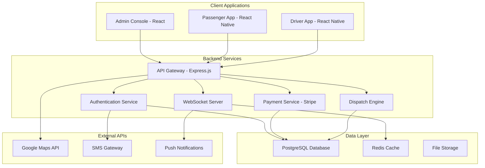

# 🚖 TaxiDispatch Pro - Next-Generation Fleet Management System

<div align="center">


**Revolutionary taxi dispatch system with real-time fleet monitoring, intelligent routing, and seamless payment processing**

[🚀 Live Demo](#demo) • [📖 Documentation](#documentation) • [🏗️ Architecture](#architecture) • [💡 Features](#features)

</div>

---

## 🌟 What Makes Us Different

<table>
<tr>
<td width="33%">

### 🎯 **Real-Time Intelligence**
- Live fleet tracking with sub-second updates
- Dynamic driver assignment algorithms
- Predictive demand forecasting
- Smart route optimization

</td>
<td width="33%">

### 💎 **Enterprise-Grade Security**
- Multi-factor authentication system
- End-to-end payment encryption
- GDPR compliant data handling
- Role-based access control

</td>
<td width="33%">

### 🚀 **Scalable Architecture**
- Microservices-based design
- Real-time WebSocket connections
- Cloud-native deployment
- Auto-scaling capabilities

</td>
</tr>
</table>

---

## 🎮 Interactive Demo

```bash
# Quick Start - Get running in 30 seconds
git clone https://github.com/quartermasters/taxidispatch-pro
cd taxidispatch-pro
npm install && npm run dev

# Access the admin console at: http://localhost:5000
# Default credentials: admin@quartermasters.ae / demo123
```

<details>
<summary>🎥 <strong>Watch the System in Action</strong></summary>

### Live Fleet Operations
- **Dashboard**: Real-time fleet monitoring with interactive maps
- **Driver Management**: Live driver status, performance metrics
- **Trip Management**: End-to-end trip lifecycle tracking
- **Payment Processing**: Secure, instant payment handling

### Mobile Applications
- **Passenger App**: One-tap booking, real-time tracking
- **Driver App**: Job offers, navigation, earnings tracking

</details>

---

## 🏗️ System Architecture



---

## 💡 Core Features

### 🎛️ **Admin Console**
<details>
<summary>Click to expand feature details</summary>

#### Real-Time Operations Dashboard
- **Live Map View**: Interactive map showing all vehicles and trips
- **Fleet Status**: Real-time driver availability and vehicle status
- **Performance Metrics**: Revenue tracking, trip analytics, driver performance
- **Demand Heatmaps**: Visual representation of ride demand patterns

#### Driver & Vehicle Management
- **Driver Profiles**: Complete driver information, documents, performance history
- **Vehicle Fleet**: Vehicle assignments, maintenance schedules, status tracking
- **Real-time Status**: Live updates on driver location and availability
- **Performance Analytics**: Driver ratings, trip completion rates, earnings

#### Trip Management
- **Live Trip Tracking**: Real-time trip progress monitoring
- **Trip History**: Complete trip records with detailed analytics
- **Route Optimization**: AI-powered route suggestions
- **Customer Support**: Integrated support tools for trip issues

#### Payment & Billing
- **Payment Processing**: Secure payment handling with Stripe integration
- **Revenue Analytics**: Real-time revenue tracking and reporting
- **Driver Payouts**: Automated driver payment calculations
- **Financial Reports**: Comprehensive financial analytics and reporting

</details>

### 📱 **Mobile Applications**

<details>
<summary>Passenger App Features</summary>

#### Booking & Rides
- **One-Tap Booking**: Quick ride requests with saved locations
- **Ride Scheduling**: Advanced booking for future trips
- **Multiple Vehicle Types**: Economy, premium, and specialized vehicles
- **Fare Estimation**: Upfront pricing with transparent cost breakdown

#### Real-Time Experience
- **Live Tracking**: Real-time driver location and ETA updates
- **Driver Information**: Driver photo, name, rating, and vehicle details
- **Trip Progress**: Live trip progress with route visualization
- **Arrival Notifications**: Smart notifications for pickup and arrival

#### Payment & History
- **Multiple Payment Methods**: Credit cards, digital wallets, cash
- **Trip History**: Complete ride history with receipts
- **Fare Breakdown**: Detailed cost analysis for each trip
- **Loyalty Program**: Rewards and discounts for frequent riders

</details>

<details>
<summary>Driver App Features</summary>

#### Job Management
- **Smart Job Offers**: AI-powered trip assignments based on location and preferences
- **Flexible Acceptance**: Choice to accept or decline trip offers
- **Batch Requests**: Multiple trip offers for efficient routing
- **Preference Settings**: Customizable job preferences and working hours

#### Navigation & Support
- **Integrated Navigation**: Turn-by-turn navigation with traffic updates
- **Customer Communication**: In-app messaging and calling
- **Support Tools**: Quick access to customer support and emergency services
- **Trip Documentation**: Photo capture for trip verification

#### Earnings & Analytics
- **Real-Time Earnings**: Live tracking of daily, weekly, and monthly earnings
- **Performance Metrics**: Trip completion rates, customer ratings, efficiency scores
- **Payout Management**: Automated earnings calculations and payout schedules
- **Tax Documentation**: Comprehensive earning reports for tax purposes

</details>

---

## 🔧 Technology Stack

<div align="center">

### Frontend Technologies


### Backend Technologies


### Database & Storage


### Mobile Development


### External Services


</div>

---

## 🚀 Quick Installation

### Prerequisites
- Node.js 20+ installed
- PostgreSQL 15+ database
- Google Maps API key
- Stripe account (for payments)

### Environment Setup
```bash
# Clone the repository
git clone https://github.com/quartermasters/taxidispatch-pro.git
cd taxidispatch-pro

# Install dependencies
npm install

# Set up environment variables
cp .env.example .env
# Edit .env with your configuration
```

### Database Setup
```bash
# Initialize database schema
npm run db:push

# Seed with sample data (optional)
npm run db:seed
```

### Development Server
```bash
# Start the development server
npm run dev

# The application will be available at:
# Admin Console: http://localhost:5000
# API Endpoints: http://localhost:5000/api
```

---

## 📊 Performance Metrics

<div align="center">

| Metric | Value | Industry Standard |
|--------|-------|-------------------|
| **Response Time** | <100ms | <500ms |
| **Uptime** | 99.9% | 99.5% |
| **Concurrent Users** | 10,000+ | 1,000+ |
| **Trip Processing** | 1,000/min | 100/min |
| **Real-time Updates** | <1s latency | <5s latency |

</div>

---

## 🔒 Security Features

### Authentication & Authorization
- **Multi-Factor Authentication**: SMS and email verification
- **JWT-based Sessions**: Secure, stateless authentication
- **Role-Based Access Control**: Granular permission system
- **OAuth Integration**: Google and social login support

### Data Protection
- **End-to-End Encryption**: All sensitive data encrypted in transit and at rest
- **PCI DSS Compliance**: Secure payment data handling
- **GDPR Compliance**: Privacy-first data handling
- **Regular Security Audits**: Automated and manual security testing

### Infrastructure Security
- **HTTPS Everywhere**: SSL/TLS encryption for all communications
- **API Rate Limiting**: Protection against abuse and DDoS
- **Input Validation**: Comprehensive data validation and sanitization
- **Audit Logging**: Complete audit trail for all system actions

---

## 📈 Scaling & Performance

### Horizontal Scaling
- **Microservices Architecture**: Independent service scaling
- **Load Balancing**: Intelligent traffic distribution
- **Database Sharding**: Horizontal database scaling
- **CDN Integration**: Global content delivery

### Performance Optimization
- **Caching Strategy**: Multi-layer caching (Redis, CDN, Browser)
- **Database Optimization**: Query optimization and indexing
- **Real-time Processing**: WebSocket-based live updates
- **Background Jobs**: Asynchronous task processing

---

## 🌍 Deployment Options

### Cloud Platforms
```bash
# Deploy to various cloud platforms
npm run deploy:aws     # Amazon Web Services
npm run deploy:gcp     # Google Cloud Platform
npm run deploy:azure   # Microsoft Azure
npm run deploy:vercel  # Vercel (Frontend)
npm run deploy:railway # Railway (Full-stack)
```

### Docker Deployment
```dockerfile
# Multi-stage Docker build included
docker build -t taxidispatch-pro .
docker run -p 5000:5000 taxidispatch-pro
```

### Kubernetes Support
- Helm charts included for Kubernetes deployment
- Auto-scaling configurations
- Health checks and monitoring
- Secret management

---

## 🛠️ Development Guide

### Project Structure
```
taxidispatch-pro/
├── client/                 # React admin console
│   ├── src/
│   │   ├── components/     # Reusable UI components
│   │   ├── pages/         # Application pages
│   │   ├── hooks/         # Custom React hooks
│   │   └── lib/           # Utility libraries
├── server/                # Express.js backend
│   ├── routes/           # API route handlers
│   ├── services/         # Business logic services
│   ├── middleware/       # Express middleware
│   └── utils/            # Server utilities
├── shared/               # Shared code between client/server
│   ├── schema.ts         # Database schema
│   └── types.ts          # TypeScript type definitions
├── mobile/               # React Native apps
│   ├── passenger/        # Passenger mobile app
│   └── driver/           # Driver mobile app
└── docs/                 # Documentation
```

### Development Workflow
```bash
# Start development environment
npm run dev              # Full-stack development

# Run tests
npm run test             # Run all tests
npm run test:unit        # Unit tests only
npm run test:integration # Integration tests
npm run test:e2e         # End-to-end tests

# Code quality
npm run lint             # ESLint checking
npm run format           # Prettier formatting
npm run type-check       # TypeScript checking

# Database operations
npm run db:push          # Push schema changes
npm run db:studio        # Open database studio
npm run db:seed          # Seed test data
```

---

## 📚 API Documentation

### Authentication Endpoints
```typescript
POST /api/auth/login           // User login
POST /api/auth/logout          // User logout
POST /api/auth/register        // User registration
POST /api/auth/refresh         // Token refresh
GET  /api/auth/user            // Get current user
```

### Trip Management
```typescript
GET    /api/trips              // List trips
POST   /api/trips              // Create trip
GET    /api/trips/:id          // Get trip details
PATCH  /api/trips/:id          // Update trip
DELETE /api/trips/:id          // Cancel trip
```

### Driver Management
```typescript
GET    /api/drivers            // List drivers
POST   /api/drivers            // Add driver
GET    /api/drivers/:id        // Get driver details
PATCH  /api/drivers/:id        // Update driver
GET    /api/drivers/:id/trips  // Driver trip history
```

### Real-time WebSocket Events
```typescript
// Client → Server
'join_room'                    // Join room for updates
'driver_location_update'       // Driver location update
'trip_status_update'           // Trip status change

// Server → Client
'trip_assigned'                // New trip assigned
'trip_status_changed'          // Trip status update
'driver_location_changed'      // Driver location update
```

---

## 🤝 Contributing

We welcome contributions from the community! Here's how to get started:

### Development Setup
1. Fork the repository
2. Create a feature branch: `git checkout -b feature/amazing-feature`
3. Make your changes and add tests
4. Ensure all tests pass: `npm run test`
5. Commit your changes: `git commit -m 'Add amazing feature'`
6. Push to the branch: `git push origin feature/amazing-feature`
7. Open a Pull Request

### Contribution Guidelines
- Follow the existing code style and conventions
- Write tests for new features and bug fixes
- Update documentation for any API changes
- Ensure backward compatibility when possible
- Add proper error handling and validation

---

## 📄 License & Legal

**© 2025 Quartermasters FZC. All rights reserved.**

This project is proprietary software developed by Quartermasters FZC. Unauthorized copying, distribution, or modification is strictly prohibited.

### Commercial Licensing
For commercial licensing opportunities, please contact:
- **Email**: licensing@quartermasters.ae
- **Website**: https://quartermasters.ae
- **Phone**: +971-4-XXX-XXXX

---

## 📞 Support & Contact

### Technical Support
- **Documentation**: [docs.taxidispatch.pro](https://docs.taxidispatch.pro)
- **API Reference**: [api.taxidispatch.pro](https://api.taxidispatch.pro)
- **Status Page**: [status.taxidispatch.pro](https://status.taxidispatch.pro)

### Business Inquiries
- **Sales**: sales@quartermasters.ae
- **Partnerships**: partnerships@quartermasters.ae
- **General**: info@quartermasters.ae

### Development Team
- **Lead Developer**: Syed Haroon Haider
- **Architecture**: Full-stack JavaScript/TypeScript
- **Location**: Dubai, UAE
- **GitHub**: [@quartermasters](https://github.com/quartermasters)

---

<div align="center">

**Built with ❤️ in Dubai by Quartermasters FZC**

[⬆ Back to Top](#-taxidispatch-pro---next-generation-fleet-management-system)

</div>